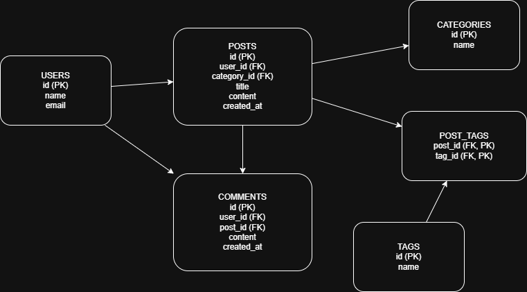
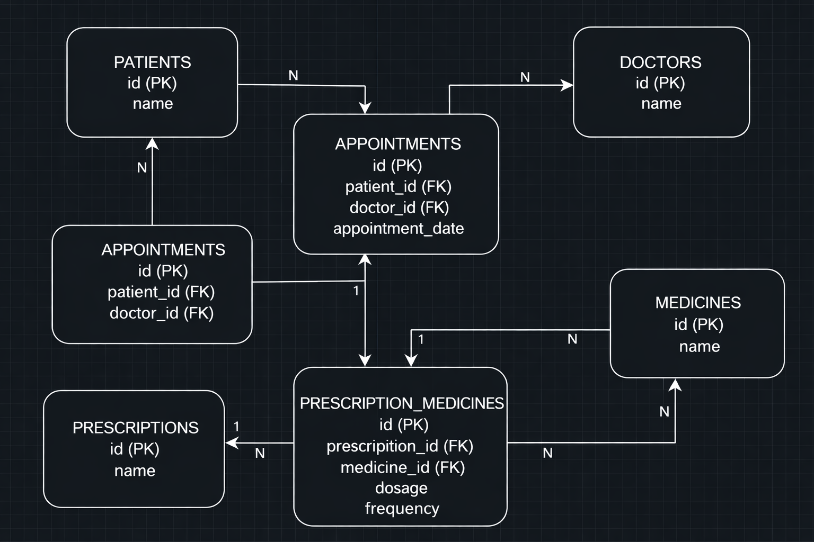

# Session 06: Database Design

## Project Overview

This project focuses on designing two database systems:

* **Blog Management System**
* **Hospital Management System**

Each system includes:

* Entity Relationship Diagram (ERD)
* SQL schema (CREATE TABLE statements)
* Normalization and relationship analysis

---

## Part 1: Normalization

| Table Name | Primary Key       | Foreign Key          | Normal Form | Description              |
| :--------- | :---------------- | :------------------- | :---------- | :----------------------- |
| users      | id                | None                 | 3NF         | Stores user information  |
| categories | id                | None                 | 3NF         | Stores post categories   |
| posts      | id                | user_id, category_id | 3NF         | Stores blog posts        |
| comments   | id                | user_id, post_id     | 3NF         | Stores comments on posts |
| tags       | id                | None                 | 3NF         | Stores tags              |
| post_tags  | (post_id, tag_id) | post_id, tag_id      | 3NF         | Links posts and tags     |

---

## Part 2: Relationships

* **Users to Posts:** One-to-Many (1:N). One user can create many posts.
* **Posts to Categories:** Many-to-One (N:1). Many posts belong to one category.
* **Posts to Comments:** One-to-Many (1:N). One post can have many comments.
* **Users to Comments:** One-to-Many (1:N). One user can write many comments.
* **Posts to Tags:** Many-to-Many (N:N). A post can have multiple tags and a tag can belong to multiple posts.

---

## Part 3: Blog ERD



---

## Part 4: Hospital ERD



---

## Folder Structure

```
session_06_database_design
 ├── diagrams/
 │    ├── blog_erd.png
 │    ├── hospital_erd.png
 ├── sql/
 │    ├── blog_schema.sql
 │    ├── hospital_schema.sql
 ├── README.md
```

---

## Notes

* All table names use **snake_case** format.
* SQL scripts are tested and executable without errors.
* ERD diagrams clearly show relationships and keys.
* Images are stored in the `/diagrams` folder.

---

## Conclusion

This project demonstrates the ability to:

* Design relational databases
* Apply normalization (up to 3NF)
* Define relationships between entities
* Implement database schemas using SQL
